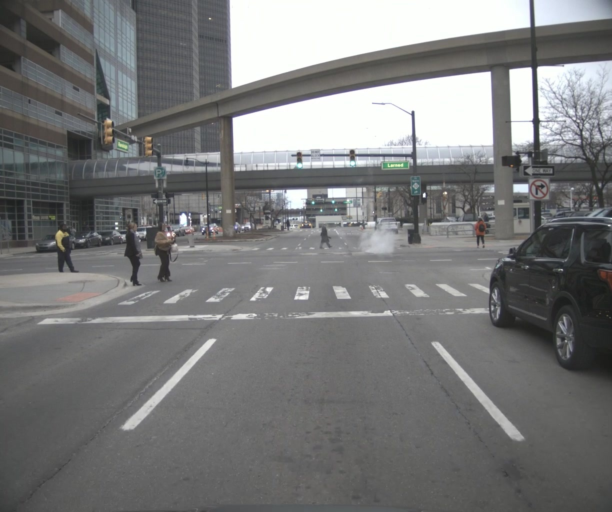
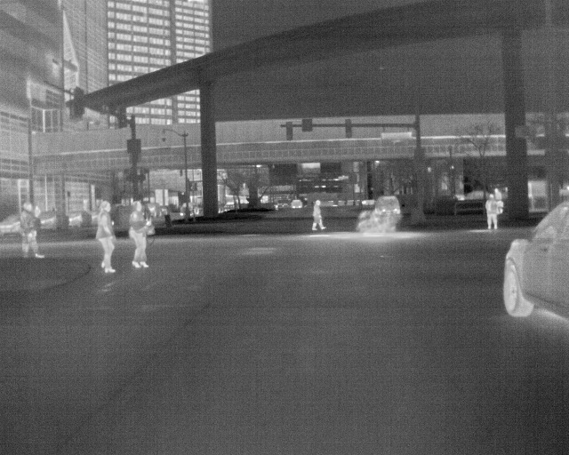

<h1 align="center">Object Detection using RoboFlow and YOLOv8</h1>

The project was made as a lab of the class "Perception and AI". 
The goal was to detect objects in images using YOLOv8 and RoboFlow.

<h2>Dataset preparation</h2>

The dataset is a custom one, and it was composed of images of a dashcam of a car in both RGB and IR.

<table>
  <tr>
    <th align="center">RGB images</th>
    <th align="center">IR images</th>
  </tr>
  <tr>
    <td align="center">
      
    </td>
    <td align="center">
      
    </td>
  </tr>
</table>

Dataset was uploaded to Roboflow and 20 samples from each RGB and IR dataset were annotated manually. Only noise augmentation was implemented. 
 
When exporting, a ratio of 80/20 of train/val was chosen.
 

How to Run the project:
 Create a folder in app/data_rgb
 Create a folder in app/data_ir
 Add the images/frames for which the detection needs to take place.
 Input images not available in the repo. Please add the input images.
 Change the directory in main.py accordingly

Then:
 cd aic_5202a_perception/app
 `pip install -r requirements.txt`
 Open docker desktop
 `docker-compose up`
 `python main.py`
 
 A window will pop-up with the image detection.
 Metrics can be verified in localhost:8002/metrics
